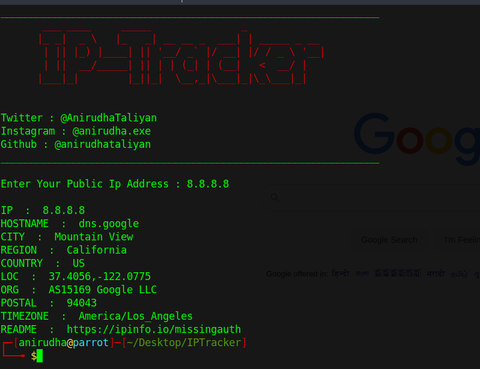

## IP Tracker

This is a tool which serves the feature of fetching out information about any IP address (i.e., any computer device that is publically connected to the internet, and we just need the address of it). The tool is written in Python3. <br>
__Dependencies__ :
* _requests_ - python3 module

__Usage__ :
* First clone the repository from github mirror of it, using the command ```git clone https://github.com/anirudhataliyan/IPTracker/``` [Type these commands in the terminal].
* Use this command to install the dependencies - ```pip3 install -r requirements.txt```.
* Run the script using these commands - ```python3 IPTracker.py```

__Working screenshot__ :
<br>


### About the author

The tool is created by Anirudha Taliyan, on November 18, 2020.

__Contributors__ :
* Anirudha Taliyan (github:https://github.com/anirudhataliyan/, email:akt746083@gmail.com)
* Rishav Das (github:https://github.com/rdofficial/, email:rdofficial192@gmail.com)
